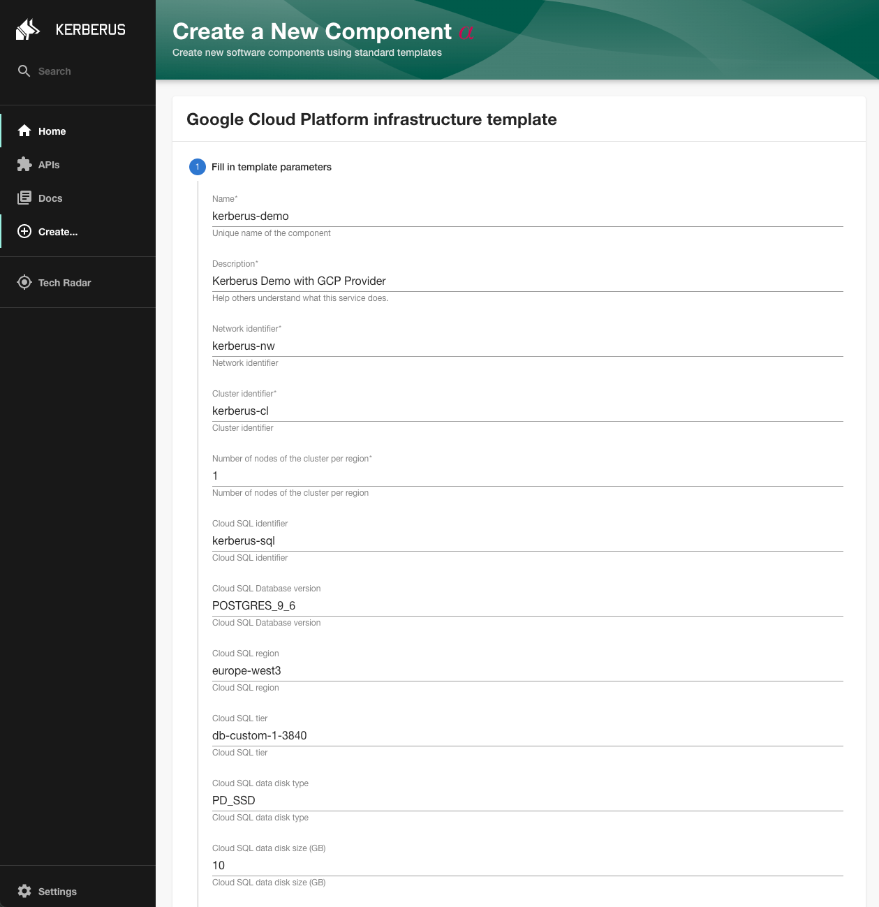
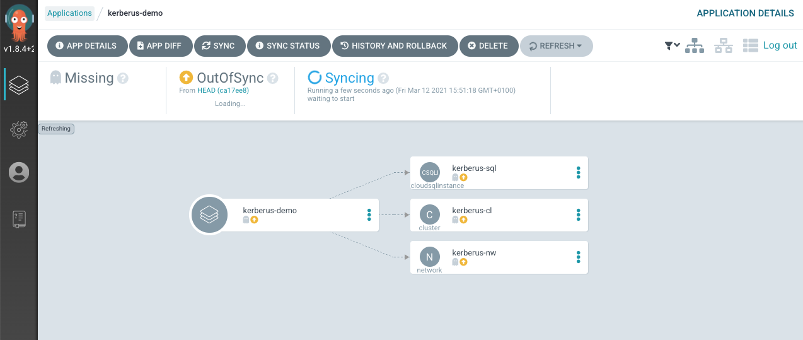

# Tutorial

## Introduction

This tutorial demonstrates the basic steps to install and configure the `Kerberus Dashboard` that provides a GUI for the self-service concept provided by Kerberus, including:

* a **service catalog** for managing all your software (microservices, libraries, data pipelines, websites, ML models, etc.)
* numerous **software templates** for quickly spinning up new projects and standardizing your tooling with your organization’s best practices
* a **technical documentation** for making it easy to create, maintain, find, and use technical documentation, using a "docs like code" approach
* a growing ecosystem of **open source plugins** that further expand Kerberus’s customizability and functionality

## Installation of Kerberus dashboard
Please follow the official guide:
* [GCP Kerberus Platform](https://github.com/projectkerberus/kerberus-platform/blob/main/INSTALL.md);
* [AWS Kerberus Platform](https://github.com/projectkerberus/kerberus-platform-aws/blob/main/INSTALL.md).

### Test with a template
Kerberus Dashboard have out-of-the-box this templates:
* [GCP template](https://github.com/projectkerberus/gcp-stack-template/blob/main/template.yaml);
* [AWS template](https://github.com/projectkerberus/aws-stack-template/blob/main/template.yaml);
* [Azure template](https://github.com/projectkerberus/azure-stack-template/blob/main/template.yaml).

In this example we will use the [GCP template](https://github.com/projectkerberus/gcp-stack-template/blob/main/template.yaml) to deploy some resources on [GCP](https://console.cloud.google.com/).

Import sample template:
  
  
  
Create component based on GCP template:
  
  
  
Check the application defined on ArgoCD:
   In case of unavailability of a public DNS (as in our case), manually execute the API call performed by the GitHub action in order to create the application on ArgoCD:
  
  
  
Check resources on GCP project:
  
  
  
