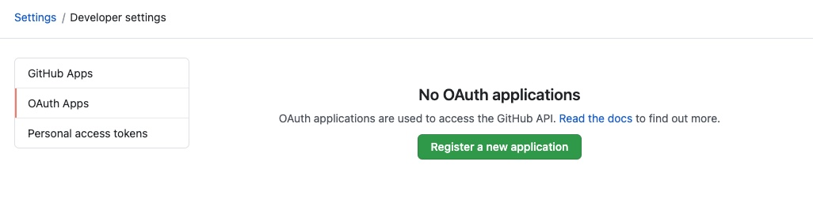

# Tutorial

## Introduction

This tutorial demonstrates the basic steps to install and configure the `Kerberus Dashboard` that provides a GUI for the self-service concept provided by Kerberus, including:

* a **service catalog** for managing all your software (microservices, libraries, data pipelines, websites, ML models, etc.)
* numerous **software templates** for quickly spinning up new projects and standardizing your tooling with your organization’s best practices
* a **technical documentation** for making it easy to create, maintain, find, and use technical documentation, using a "docs like code" approach
* a growing ecosystem of **open source plugins** that further expand Kerberus’s customizability and functionality

## Requirements

* [Minikube](https://minikube.sigs.k8s.io/docs/start/)
* [Helm](https://helm.sh/docs/intro/install/)
* Creation of OAuth application on GitHub

## Installation of Kerberus dashboard

### OAuth application on GitHub

To create an OAuth app for local development, visit [your OAuth Apps settings page on GitHub](https://github.com/settings/developers). Click the “New OAuth App” button and you’ll see a form you have to fill out.



Filling the form:

* **Application name**: *Kerberus Dashboard*
* **Homepage URL**: *<https://kerberus-dashboard.demo.io>*
* **Authorization callback URL**: *<https://kerberus-dashboard.demo.io/api/auth/github/handler/frame>*


Create a client secret:


Export `Client ID` and `Client secret`:

```bash
AUTH_GITHUB_CLIENT_ID=...
AUTH_GITHUB_CLIENT_SECRET=...
```

### Start Minikube

```bash
minikube start
minikube addons enable ingress
```

### Configure ArgoCD

Create a `values-argo.yaml` file with the content:

```yaml
server:
  extraArgs:
    - --insecure

  ingress:
    enabled: true
    
    hosts:
      - argocd.demo.io
  
  config:
    url: https://argocd.demo.io
    accounts.kerberus-dashboard: apiKey
    accounts.kerberus-dashboard.enabled: "true"

  rbacConfig:
    policy.csv: |
      p, user:kerberus-dashboard, *, *, */*, allow
```

```bash
helm repo add argo https://argoproj.github.io/argo-helm
helm install -f values-argo.yaml argo/argo-cd --generate-name --namespace=argocd --create-namespace

ARGO_ADMIN_PASSWORD=$(kubectl get pods -n argocd -l app.kubernetes.io/name=argocd-server -o name | cut -d'/' -f 2)
```

In order to generate token you have to retrieve a valid beare token:

```bash
ARGO_AUTH_BEARER_TOKEN=$(curl -k --location --request POST 'https://argocd.demo.io/api/v1/session' \
--header 'Content-Type: application/json' \
--data-raw '{
    "username": "admin",
    "password": "'"$ARGO_ADMIN_PASSWORD"'"
}' 2>/dev/null | jq -r '.token')

ARGO_SERVICE_ACCOUNT_TOKEN=$(curl -k --location --request POST 'https://argocd.demo.io/api/v1/account/kerberus-dashboard/token' \
--header "Authorization: Bearer $AUTH_BEARER_TOKEN" 2>/dev/null | jq -r '.token')
```

### Create service account for Kerberus Dashboard on K8S cluster

```bash
cat <<EOF | kubectl apply -f -
apiVersion: v1
kind: Namespace
metadata:
  name: kerberus-dashboard
---
apiVersion: v1
kind: ServiceAccount
metadata:
  name: kerberus-admin
  namespace: kerberus-dashboard
---
apiVersion: rbac.authorization.k8s.io/v1
kind: ClusterRoleBinding
metadata:
  name: kerberus-admin
roleRef:
  apiGroup: rbac.authorization.k8s.io
  kind: ClusterRole
  name: cluster-admin
subjects:
  - kind: ServiceAccount
    name: kerberus-admin
    namespace: kerberus-dashboard
EOF

K8S_SERVICE_ACCOUNT_SECRET=$(k get serviceaccount -n kerberus-dashboard kerberus-admin -o jsonpath="{.secrets[0].name}")
K8S_SERVICE_ACCOUNT_TOKEN=$(kubectl get secret -n kerberus-dashboard $K8S_SERVICE_ACCOUNT_SECRET -o jsonpath='{.data.token}' | base64 --decode)
```

### Configure Kerberus dashboard

```bash
wget -O values-dashboard.yaml https://github.com/projectkerberus/kerberus-dashboard/raw/main/charts/kerberus-dashboard/values.minikube.yaml
```

Edit `values-dashboard.yaml` setting values for GitHub authentication:

```yaml
app:
  env:
    argo_token: ...             # ARGO_SERVICE_ACCOUNT_TOKEN
    github_client_id: ...       # AUTH_GITHUB_CLIENT_ID
    github_client_secret: ...   # AUTH_GITHUB_CLIENT_SECRET
    github_token: ...           # Valid access token to GitHub account
    k8s_cluster_token: ...      # K8S_SERVICE_ACCOUNT_TOKEN
```

and install the Helm chart setting the default storage class to the default one provided by Minikube:

```bash
helm repo add project-kerberus https://projectkerberus.github.io/kerberus-dashboard/
helm install -f values-dashboard.yaml project-kerberus/kerberus-dashboard --generate-name --namespace=kerberus-dashboard --create-namespace
```

The ingress defined during the installation use a FQDN `kerberus-dashboard.demo.io`. So, add a line for this resolution to you `/etc/hosts` file:

```bash
➜ minikube ip
192.168.99.111

➜ echo "192.168.99.111  kerberus-dashboard.demo.io" >> /etc/hosts
```

### Configure scaffolder plugin

Through `scaffolder` plugin Kerberus generates each git repository which will contain the source code of the components. In order to be able to create repositories you have to [configure an access token on your GitHub account](https://docs.github.com/en/github/authenticating-to-github/creating-a-personal-access-token) and set the value of `github_token` inside `values.yaml`:

```yaml
app:
  env:
    github_token: zzz
```