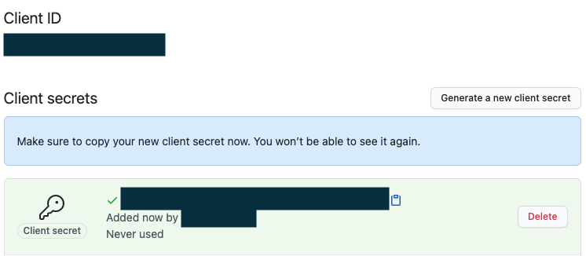
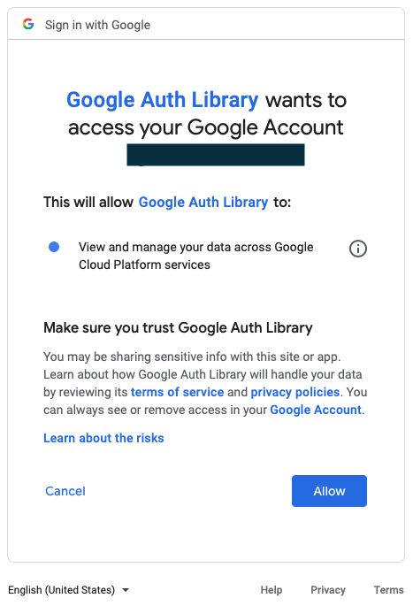
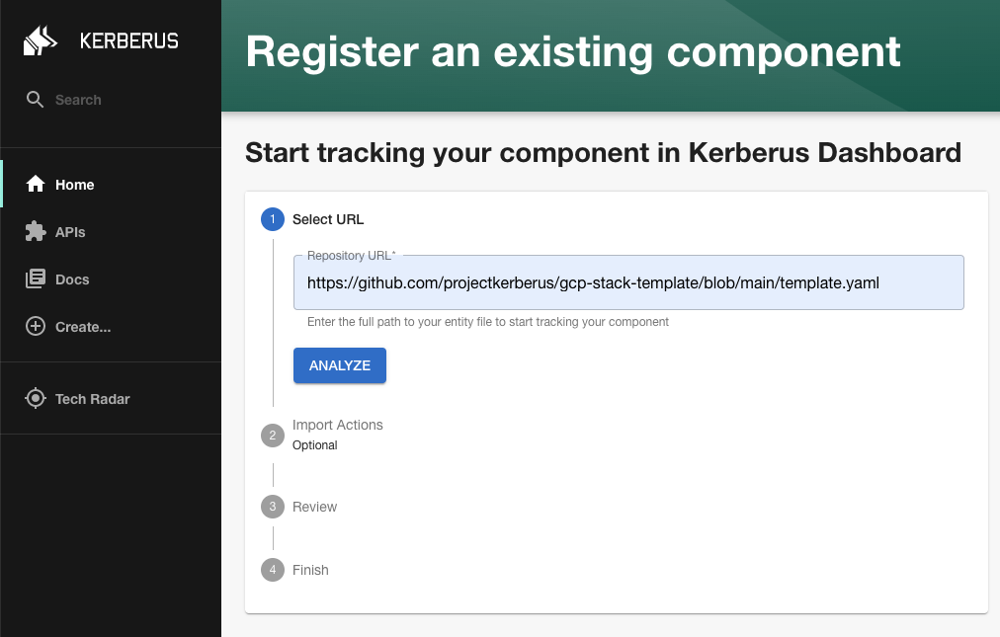
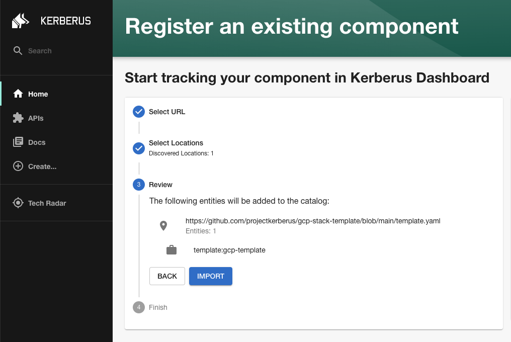
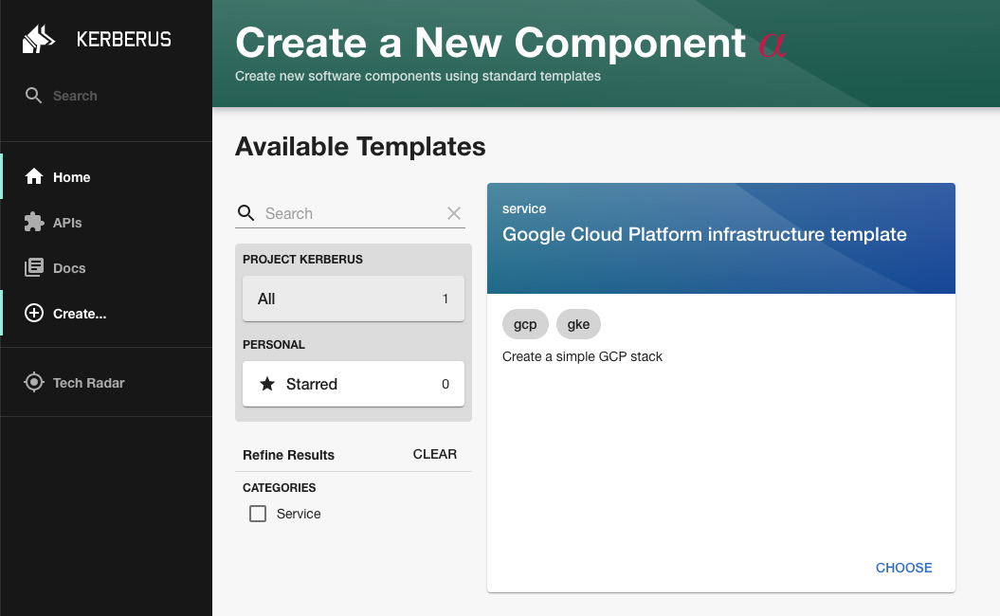
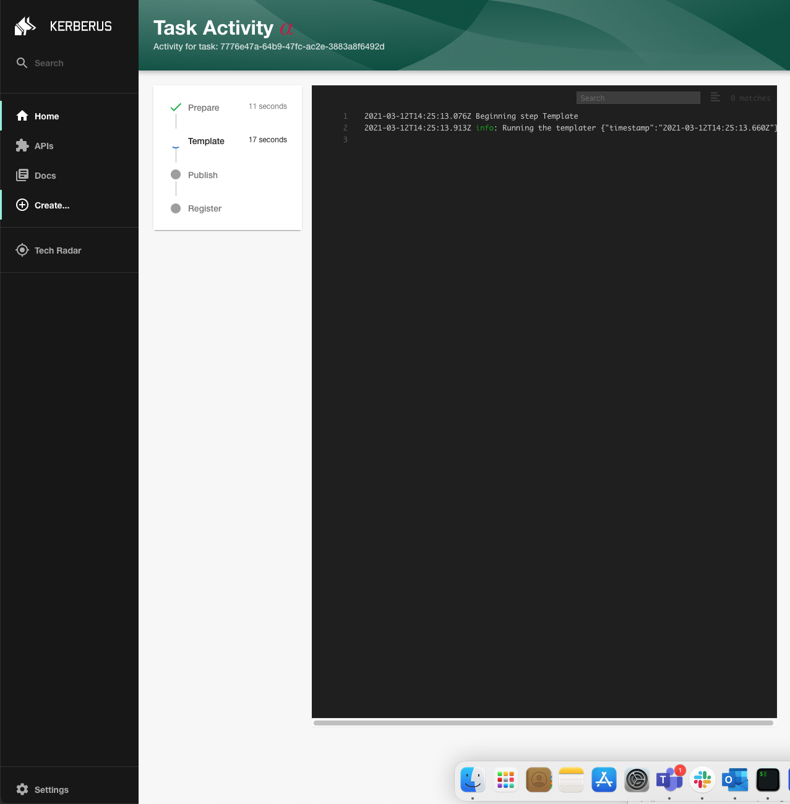
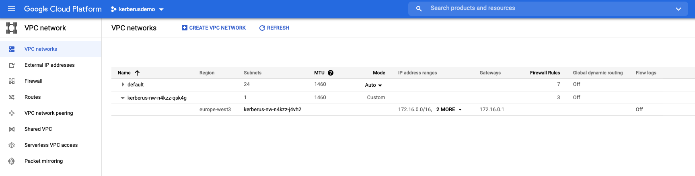
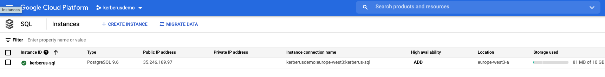

# Tutorial

## Introduction

This tutorial demonstrates the basic steps to install and configure the `Kerberus Dashboard` that provides a GUI for the self-service concept provided by Kerberus, including:

* a **service catalog** for managing all your software (microservices, libraries, data pipelines, websites, ML models, etc.)
* numerous **software templates** for quickly spinning up new projects and standardizing your tooling with your organization’s best practices
* a **technical documentation** for making it easy to create, maintain, find, and use technical documentation, using a "docs like code" approach
* a growing ecosystem of **open source plugins** that further expand Kerberus’s customizability and functionality

## Requirements

* [Minikube](https://minikube.sigs.k8s.io/docs/start/)
* [Helm](https://helm.sh/docs/intro/install/)
* Creation of OAuth application on GitHub
* [Terraform OSS](https://www.terraform.io/downloads.html) (tested with version v0.14.4)
* [kubectl CLI](https://kubernetes.io/docs/reference/kubectl/)
* [gcloud CLI](https://cloud.google.com/sdk/gcloud/reference/auth/application-default/login)
* [Crossplane CLI](https://crossplane.io/docs/v1.0/getting-started/install-configure.html#install-crossplane-cli)

## Installation of Kerberus dashboard

### OAuth application on GitHub

To create an OAuth app for local development, visit [your OAuth Apps settings page on GitHub](https://github.com/settings/developers). Click the “New OAuth App” button and you’ll see a form you have to fill out.


Filling the form:

* **Application name**: *Kerberus Dashboard*
* **Homepage URL**: *<https://kerberus-dashboard.demo.io>*
* **Authorization callback URL**: *<https://kerberus-dashboard.demo.io/api/auth/github/handler/frame>*


Create a client secret:



Export `Client ID` and `Client secret`:

```bash
➜ AUTH_GITHUB_CLIENT_ID=...
➜ AUTH_GITHUB_CLIENT_SECRET=...
```

### Start Minikube

```bash
➜ minikube start
😄  minikube v1.10.1 on Darwin 11.2.3
✨  Using the virtualbox driver based on user configuration
👍  Starting control plane node minikube in cluster minikube
🔥  Creating virtualbox VM (CPUs=2, Memory=2200MB, Disk=20000MB) ...
🐳  Preparing Kubernetes v1.18.2 on Docker 19.03.8 ...
🔎  Verifying Kubernetes components...
🌟  Enabled addons: default-storageclass, storage-provisioner
🏄  Done! kubectl is now configured to use "minikube"

➜ minikube addons enable ingress
🌟  The 'ingress' addon is enabled

➜ kubectl config view --minify > /tmp/kubeconfig-kerberusdemo
```

### Install Crossplane and GCP Provider Config

Clone `kerberus-platform` repository:

```bash
➜ git clone https://github.com/projectkerberus/kerberus-platform.git
Cloning into 'kerberus-platform'...
remote: Enumerating objects: 69, done.
remote: Counting objects: 100% (69/69), done.
remote: Compressing objects: 100% (48/48), done.
remote: Total 69 (delta 27), reused 56 (delta 16), pack-reused 0
Unpacking objects: 100% (69/69), done.

➜ cd kerberus-platform
```

You should have a path tree like this:

```console
.
├── CODE_OF_CONDUCT.md
├── CONTRIBUTING.md
├── INSTALL.md
├── LICENSE
├── README.md
├── docs
├── main.tf
├── output.tf
├── values.yaml
└── variables.tf

2 directories, 11 files
```

Create `terraform.tfvars` with the content:

```yaml
GCP_PROJECT = "kerberusdemo"
GCP_SA = "kerberusdemo-sa"
PATH_KUBECONFIG = "/tmp/kubeconfig-kerberusdemo"
CROSSPLANE_REGISTRY = "ghcr.io/projectkerberus/platform-ref-gcp:latest"
ARGOCD_HOSTNAME = "argocd.demo.io"
```

Once [gcloud CLI is installed](https://cloud.google.com/sdk/docs/install), login with application-default method:

```bash
➜ gcloud auth application-default login
Your browser has been opened to visit:

    https://accounts.google.com/o/oauth2/auth?...
```

Confirming on form:



And [create a project](https://cloud.google.com/resource-manager/docs/creating-managing-projects) called `kerberusdemo`.

### Configure ArgoCD

Create a `values.yaml` file with the content:

```yaml
server:
  extraArgs:
    - --insecure

  ingress:
    enabled: true
    
    hosts:
      - argocd.demo.io
  
  config:
    url: https://argocd.demo.io
    accounts.kerberus-dashboard: apiKey
    accounts.kerberus-dashboard.enabled: "true"

  rbacConfig:
    policy.default: role:admin
```

```bash
➜ terraform init

Initializing the backend...

Initializing provider plugins...
- Finding hashicorp/kubernetes versions matching ">= 2.0.0"...
- Finding gavinbunney/kubectl versions matching "1.9.4"...
- Finding latest version of hashicorp/google...

...

Terraform has been successfully initialized!

...

➜ terraform plan
Refreshing Terraform state in-memory prior to plan...
The refreshed state will be used to calculate this plan, but will not be
persisted to local or remote state storage.

data.google_project.my_project: Refreshing state...
...
Plan: 21 to add, 0 to change, 0 to destroy.

➜ terraform apply
data.google_project.my_project: Refreshing state...

An execution plan has been generated and is shown below.
Resource actions are indicated with the following symbols:
  + create

Terraform will perform the following actions:
...
Apply complete! Resources: 21 added, 0 changed, 0 destroyed.

Outputs:

argocd = https://argocd.demo.io
```

Add to `/etc/hosts` the resolution of the FQDN obtained for ArgoCD:

```text
##
# Host Database
#
# localhost is used to configure the loopback interface
# when the system is booting.  Do not change this entry.
##
127.0.0.1   localhost
255.255.255.255 broadcasthost
::1             localhost

192.168.99.117  argocd.demo.io
```

In order to generate token you have to retrieve a valid bearer token:

```bash
➜ ARGO_ADMIN_PASSWORD=$(kubectl get pods -n argo -l app.kubernetes.io/name=argocd-server -o name | cut -d'/' -f 2)
➜ ARGO_AUTH_BEARER_TOKEN=$(curl -k --location --request POST 'https://argocd.demo.io/api/v1/session' \
--header 'Content-Type: application/json' \
--data-raw '{
    "username": "admin",
    "password": "'"$ARGO_ADMIN_PASSWORD"'"
}' 2>/dev/null | jq -r '.token')

➜ ARGO_SERVICE_ACCOUNT_TOKEN=$(curl -k --location --request POST 'https://argocd.demo.io/api/v1/account/kerberus-dashboard/token' \
--header "Authorization: Bearer $ARGO_AUTH_BEARER_TOKEN" 2>/dev/null | jq -r '.token')
```

### Create service account for Kerberus Dashboard on K8S cluster

```bash
➜ cat <<EOF | kubectl apply -f -
apiVersion: v1
kind: Namespace
metadata:
  name: kerberus-dashboard
---
apiVersion: v1
kind: ServiceAccount
metadata:
  name: kerberus-admin
  namespace: kerberus-dashboard
---
apiVersion: rbac.authorization.k8s.io/v1
kind: ClusterRoleBinding
metadata:
  name: kerberus-admin
roleRef:
  apiGroup: rbac.authorization.k8s.io
  kind: ClusterRole
  name: cluster-admin
subjects:
  - kind: ServiceAccount
    name: kerberus-admin
    namespace: kerberus-dashboard
EOF

➜ K8S_SERVICE_ACCOUNT_SECRET=$(k get serviceaccount -n kerberus-dashboard kerberus-admin -o jsonpath="{.secrets[0].name}")
➜ K8S_SERVICE_ACCOUNT_TOKEN=$(kubectl get secret -n kerberus-dashboard $K8S_SERVICE_ACCOUNT_SECRET -o jsonpath='{.data.token}' | base64 --decode)
```

### Configure Kerberus dashboard

```bash
➜ wget -O values-dashboard.yaml https://github.com/projectkerberus/kerberus-dashboard/raw/main/charts/kerberus-dashboard/values.minikube.yaml
```

Edit `values-dashboard.yaml` setting values for GitHub authentication:

```yaml
app:
  env:
    argo_token: ...             # ARGO_SERVICE_ACCOUNT_TOKEN
    github_client_id: ...       # AUTH_GITHUB_CLIENT_ID
    github_client_secret: ...   # AUTH_GITHUB_CLIENT_SECRET
    github_token: ...           # Valid access token to GitHub account
    k8s_cluster_token: ...      # K8S_SERVICE_ACCOUNT_TOKEN
```

and install the Helm chart setting the default storage class to the default one provided by Minikube:

```bash
➜ helm repo add project-kerberus https://projectkerberus.github.io/kerberus-dashboard/
➜ helm install -f values-dashboard.yaml project-kerberus/kerberus-dashboard --generate-name --namespace=kerberus-dashboard --create-namespace
```

The ingress defined during the installation uses the FQDN `kerberus-dashboard.demo.io`. So, add a line for this resolution to you `/etc/hosts` file:

```text
##
# Host Database
#
# localhost is used to configure the loopback interface
# when the system is booting.  Do not change this entry.
##
127.0.0.1   localhost
255.255.255.255 broadcasthost
::1             localhost

192.168.99.117  argocd.demo.io
192.168.99.117  kerberus-dashboard.demo.io
```

The dashboard and ArgoCD Frontend will be available at:

* <https://kerberus-dashboard.demo.io>
* <https://argocd.demo.io>

### Test with gcp template

1. Import sample template:
  
  
  
2. Create component based on GCP template:
  
  
  
3. Check the application defined on ArgoCD:
   In case of unavailability of public DNS, execute manually the API call performed by the GitHub action in order to create the application on ArgoCD:
  
  
  
4. Check resources on GCP project:
  
  
  
